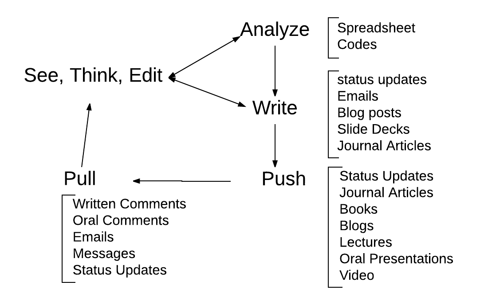

I'd like to write a paper using markdown and see the results or push it everywhere. I have a workaround using [Overleaf](http://www.overleaf.com) and the workaround goes like this:

1. I start with an Oveleaf document
2. Then create a git repository for this
3. Sync the git repo on my computer
4. Then, create documents as I need on my computer using Sublime-edit or Atom
5. Add citations using bibtex and create a bibtex file for this
6. Use pandoc to convert the markdown file to latex file
7. Push the latex file and the images and the bibliography file to Overleaf
8. Overleaf has rich text editing functions that helps me to edit the document and push everywhere
9. Also, if I write using markdown in a format say using Ulyssses, I can write using Ulysses and push it as markown then latex

This system works well. What would be terrific would be to develop a system where everything gets worked out using Markdown alone and push things around. So, in other words, rather than off and on pushing through the markdown editor on the compuer and remotely, if there could be perfect synchronicity between markdown and the final output, that would be terrific.

## Need to write tables, figures, bibliography

Advanced markdown or markdown-extra is good for writing tables, adding figures, footnotes, and also bibliography and citations from a x.bib file. 

| Points of Comparison | Web based LaTeX* | Others such as Word |
|--------------------  |--------  |-------------------  |
| Ease of Use          | Easy     | Super easy          |
| Web Friendly         | PDF      | PDF, but not much   |
|Cloud Implementation  | Great    | Not so great        |
| Rich Text editing    | Workable | Amazing             |
| Plain Text editing   | Excellent| Not happy with it   |
| Markdown editing     | None     | None                |
| Tables               | No wysiwyg|Great Wysiwyg       |
| Bibtex               | Yes      | Um, no              |
| Figures              | Easy     | wysiwyg             |
| Layout               | Intuitive| Difficult           |
| Collaboration        | Easy     | Sharing Based       |
| Everyone uses it?    | Not sure | Yes, compatible     | 
| Code Blocks          | Easy     | Not intuitive       |
| Equations            | Easy     | Not intuitive       |
| Web Connectivity     | Great    | OK                  |

This is a just a regular table of comparisons and by web based latex implementation, I mean not just Overleaf but almost everything else that look like Overleaf (such as [Papeeria](http://www.papeeria.com), or [ShareLaTeX](http://www.sharelatex.com) and others. I mean there are some plus and minus points to this way of working. One of the things that I find myself doing increasingly is to share articles as blog posts and using html format or pushing to [Medium](http://www.medium.com). Now, medium does not have ability to display tables or html tables, and to show in Medium, tabular data need to be converted to figures and then uploaded. Another way might be to use a service such as [TheWinnower](http://www.thewinnower.com) and use an html formatted article to push to The Winnower and work from there. 

## What I want

It'd be nice if we were to use the formats of writing in Scholarly markdown and without the hassles of going through rounds of pushing to Pandoc > LaTeX and then render on the web exactly as it is and push to every journal or blogs and get in responses. This is also topical because in addition to texts and tables and figures, and citations, we also work with codes and equations at least in the field where I write (that is in Epidemiology Biostats) and so code blocks etc are important \cite{Armstrong_2015}

So, here's would be really nice:

1. Write in markdown entirely not worrying about any conversion
2. Push everywhere
3. Be in perfect sync with my computer, device, and the web
4. By pushing eveywhere I mean pushing to a blog, creating a scholarly paper push to journal submissions, and preprints, and creating slide decks all from the same source
5. Sync-ing using wellcrafted markdown tools and pull from all over the web (there are excellent web based markdown editors such as [Madoko](http://madoko.net) and [classeur.io](http://classeur.io)
6. Then, when I share my document, my collaborators can edit or comment on the document using whatever format they prefer and even if they do not need to create an account, they can join in. 

